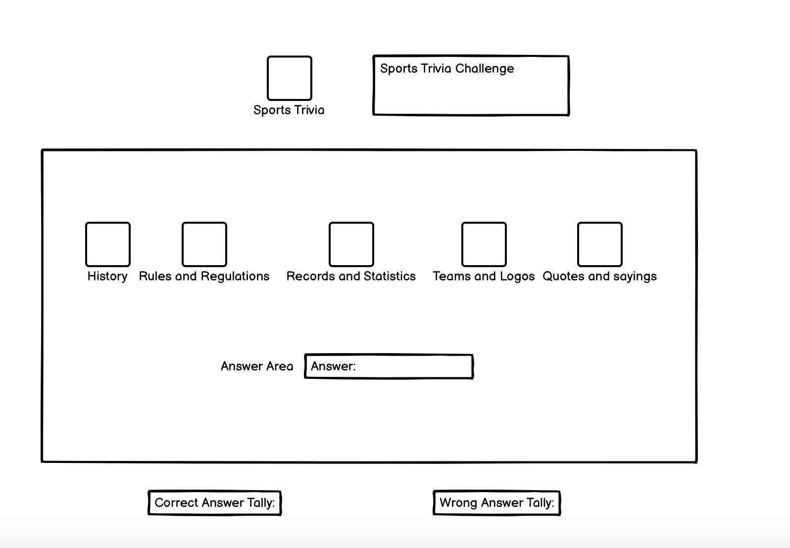
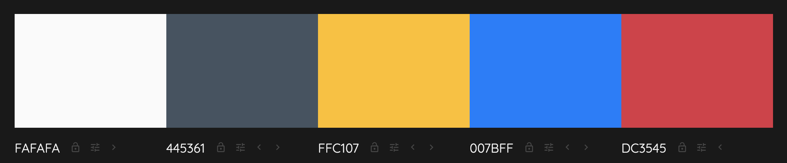
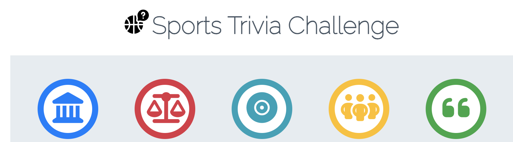
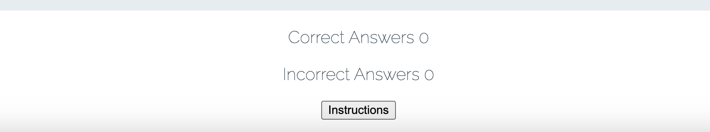
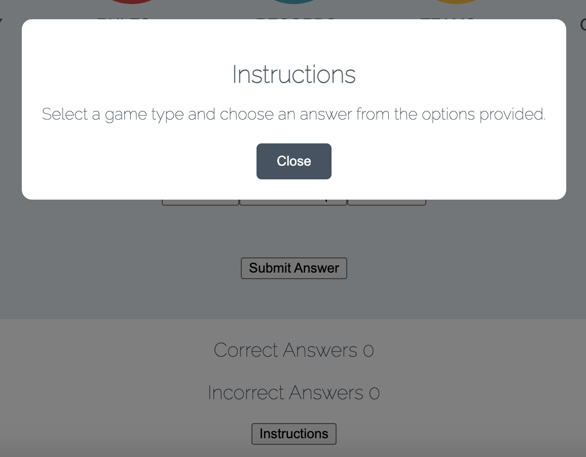

# Sports Trivia Challenge README

## Introduction

Welcome to Sports Trivia Challenge, the ultimate destination for all sports enthusiasts! Test your knowledge and compete against friends as you dive into the exciting world of sports trivia. With a wide range of categories and challenging questions, this interactive website will put your sports knowledge to the test.

Explore various categories such as Sports Trivia, Sports History, Sports Figures, English Premier League, Spanish League, UEFA Champions League, German Bundesliga, and the prestigious Ballon d'Or Awards. Each category offers a unique set of questions that will challenge your expertise in different aspects of the sports world.

## Purpose

The purpose of the website is to provide an engaging Sports Trivia Challenge for users to test their sports knowledge. With a variety of game types and responsive design, the website offers an interactive experience where players can select their preferred category, answer trivia questions, and earn points. The website aims to entertain and challenge sports enthusiasts while providing a seamless user experience across different screen sizes. Whether playing on a desktop or mobile device, users can enjoy the Sports Trivia Challenge and have fun while expanding their sports knowledge.

## Design

### Wireframe
The basic design and structure of the website was done using Balsamiq wireframe. 

### Sketches Of The Sports Trivia Challenge

The one page website was sketched out with Balsamiq wireframe as seen below:

### Color Scheme
The color panel of the website is shown below with a palette generated from colormind. These colors are carefully selected to make the website attractive and to give adequate accessibility and readability.

### Typography
Google fonts and FontAwesome is used for this website. The Google fonts 

### Imagery
The logo and icons on the Sports Trivia Challenge website were taken from Font Awesome website.

### Features
The Sports Trivia Challenge website is a one page website with these features.
Logo and header, Game area with 5 game types represented by icons and name of the game type. The question area and score area and an instruction button.

### Existing Features
- Logo
  The logo is on top placed just before the header and centered with the header.
  
- The Header 
  The header placed just after the logo which captures the essence of the website.
  
- The Game Type Area
  The game type area has the icons with labels of the game type beneath them. The sports trivia challenge has five game types and each game type has five question and users are given three options of answers to make a selection. When a question is answered, a user is immediately alerted with a correct answer or wrong aswer message and the corresponding score awarded at the score area.
  
  
- The Question Area
  The game question area comes just beneath the game type icons and label which is the area that displays the question to be answered.
  
- The Answer Area
  The game answer area beneath the question area and presents users with 3 options of answers to select from.
  
- The Score Acrea
  The game score area has two socre items, correct answers and incorrect answers, which records the results of what has been answered by the user. The defaul score is zero for each of the items.
  
- The Instruction button
  The instruction area gives users information on how to play the game when clikced.
  

### Accessibility
The website is made accessible-friendly as possible through the following measures:
- Utilizing semantic HTML to provide meaningful structure and enhance accessibility.
- Incorporating descriptive alt attributes for images on the site to provide alternative text for screen readers.
- Ensuring an adequate color contrast across the site to improve readability for users with visual impairments. I employed the contrast checker provided by colormind to validate the contrast ratio between the selected foreground color and background color.

By implementing the above measures the overall accessibiity of the website is improved.

## Technologies Employed

### Languagues Employed
This project was created using only HTML, CSS and JavaScript.

### Frameworks, Libraries & Programs Employed

- GitHub for commits/deploys
- Codeanywhere
- CSS, HTML, JavaScript
- GoogleFonts
- Balsamiq Wireframes - for wireframe design
- FontAwesome for logo and game type icons
- <https://ui.dev/amiresponsive> - to check site responsiveness
- <https://chrome.google.com/webstore/detail/unicorn-revealer/lmlkphhdlngaicolpmaakfmhplagoaln> - to check the flow of the header, logo and icons at different screen sizes and making sure there are no overflows and distortions.

## Deployment

  The depoymnent was done very early on in the project.
  The deployment of the project was done in the following steps:

- Forking the repo: The repository was created in GitHub by forking a copy from the original Code Institute repo template. This was done on GitHub by clicking the "Fork" button to create a copy of the original repository.
- Launching in IDE: After forking the repository, it was cloned or copied into Codeanywhere and opened by creating a new workspace.
- Git add/commit/push to GitHub: With the project open in your Codeanywhere, changes were made to the codebase and after desired changes, Git commands to stage the modified files (git add), create a commit with a descriptive message (git commit), and push the changes to your forked repository on GitHub (git push) were done.
- Settings: In the repository's settings on GitHub, the configuration of the branch from the main was done for deploymnent to setup up the branch for deployment.
- Pages: GitHub Pages which has the facility to host your website directly from my GitHub repository was utilized. This was enabled in GitHub Pages by navigating to the repository's settings and locating the "GitHub Pages" section. Here, the branch to deploy was configured of the website's domain as required.
- Choosing a branch & deploying: In the GitHub Pages settings, a selection of the branch that contains the code of the website. GitHub then built and deployed the website using the code from the selected main. The following deployment address was created from which the website can be accessed:
  
   [Sports Trivia Challenge](https://stephenkofipoku.github.io/sports_trivia_challenge/)

## User Stories
